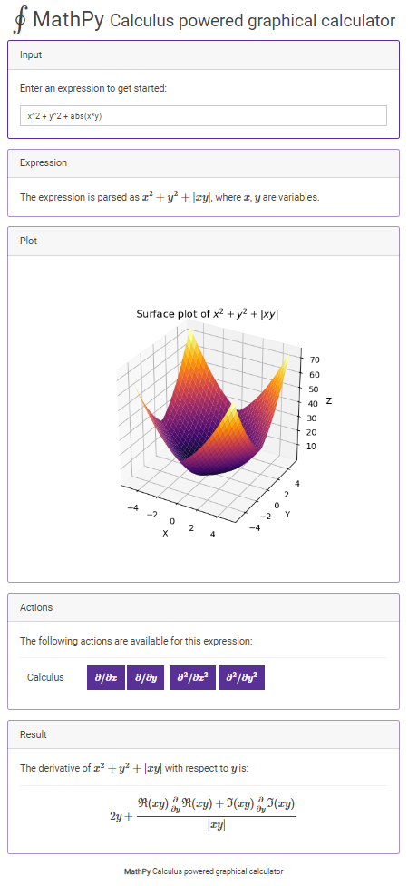

# MathPy

Calculus powered graphical calculator, check it live at 
 [`https://pymath-api-heroku.herokuapp.com/`](https://pymath-api-heroku.herokuapp.com/).

# Usage

The app has been deployed to [`https://pymath-api-heroku.herokuapp.com/`](https://pymath-api-heroku.herokuapp.com/).

The app will automatically detect how many variables there are in the expression. It is also possible to give an equality as expression.

The following options are available:

|Variables|Type|Action|
|--|--|--|
|0 - constants|Expression|It will evaluate the expression.|
|1+|Expression, equality, inequality|Simplify|
|1+|Expression, equality, inequality|Expand|
|1+|Expression, equality, inequality|Expand trig|
|1+|Expression, equality, inequality|Factor|
|1+|Expression|Factors|
|1|Expression|Line plot|
|1|Expression|Derivative|
|1|Expression|Second derivative|
|1|Expression|Indefinite integral|
|1|Expression|Integrate from 0 to T|
|1|Expression|Integrate from -inf to inf|
|2|Expression|Surface plot|
|2|Expression|Contour plot|
|2|Expression|Gradient plot|
|2+|Expression|Partial derivatives|
|2+|Expression|Second partial derivatives|
|2+|Expression|Gradient|
|2|Expression|Hessian matrix|
|1+|Equality, inequality|Solve for variable|

# Examples

The following are examples of expressions that are understood:

 * Constants (evaluate):
   * [`e^(sqrt(-1)*pi)`](https://pymath-api-heroku.herokuapp.com/?expr=exp((sqrt(-1)*pi)))
   * [`32!`](https://pymath-api-heroku.herokuapp.com/?expr=32!)
 * One variable: 
   * [`1 / (1 + x^2)`](https://pymath-api-heroku.herokuapp.com/?expr=1%20%2F%20(1%20%2B%20x%5E2))
 * Two variables: 
   * [`1 / (1 + x^2 + y^2)`](https://pymath-api-heroku.herokuapp.com/?expr=1%20%2F%20(1%20%2B%20x%5E2%20%2B%20y%5E2))
   * [`x*y`](https://pymath-api-heroku.herokuapp.com/?expr=x*y) * 
   [`sqrt(x^2 + y^2)`](https://pymath-api-heroku.herokuapp.com/?expr=sqrt(x%5E2%20%2B%20y%5E2))
   * [`exp(y) * cos(x) + exp(x) * sin(y)`](https://pymath-api-heroku.herokuapp.com/?expr=exp(y)%20*%20cos(x)%20%2B%20exp(x)%20*%20sin(y))
 * Equalities: 
   * [`z^3 + z^2 + z^1 + z = 0`](https://pymath-api-heroku.herokuapp.com/?expr=z%5E3%20%2B%20z%5E2%20%2B%20z%5E1%20%2B%20z%20%3D%200)
   * [`a*x^2 + b*x + c = 0`](https://pymath-api-heroku.herokuapp.com/?expr=a*x%5E2%2Bb*x%2Bc%3D0)
   * [`x^2 + p*x + q = 0`](https://pymath-api-heroku.herokuapp.com/?expr=x%5E2%2Bp*x%2Bq%3D0)
 * Inequalities: 
   * [`x^2 < 5`](https://pymath-api-heroku.herokuapp.com/?expr=x%5E2%20%3C%3D%205)
   * [`sqrt(x) < x`](https://pymath-api-heroku.herokuapp.com/?expr=sqrt(x)%20%3C%20x)

It is also possible to construct matrices with [`Matrix([[1,2],[3,4]]) * t`](https://pymath-api-heroku.herokuapp.com/?expr=Matrix%28%5B%5B1%2C2%5D%2C%5B3%2C4%5D%5D%29%20*%20t). Accidently, you can also create multiple line plots with the following matrix: [`Matrix([x,x^2,x^3,x^4])`](https://pymath-api-heroku.herokuapp.com/?expr=Matrix%28%5Bx%2Cx%5E2%2Cx%5E3%2Cx%5E4%5D%29). Imaginairy numbers can be declared with ).

There is no UI component yet to change the plot limits. However, it can be done manually by opening the console and entering `app.plot_xlim = app.plot_ylim = [-10,10]; app.plot()`.

# Thanks to

 * Matplotlib
 * Sympy
 * Flask
 * Vue.js
 * Mathjax

Hosted on Heroku with gUnicorn.